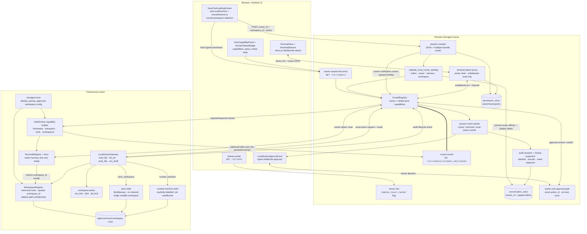
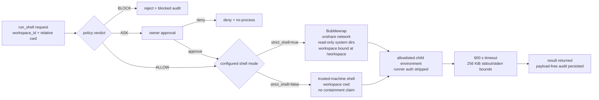
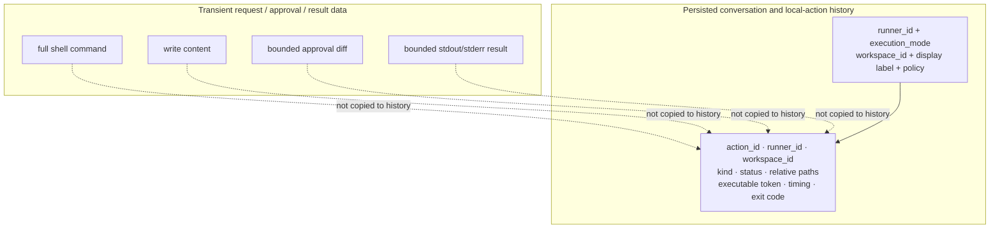

# 06 — Implemented Architecture Diagrams

Status reviewed on 2026-07-17 against PR #2,
`feat/mvp-runner-binding-approvals`. These diagrams describe production paths
that exist on the branch; they are no longer planning-only sketches. PR #3
extends the terminal lifecycle and reconnect parts of this architecture.

## 1. Runtime system architecture



### Authority boundaries

- The browser binds sessions with `runner_id + workspace_id`; the raw local
  root is never part of the create payload.
- The server validates the binding against the live tunnel registry and stores
  `runner_id` plus opaque/display labels.
- Only `WorkspaceRegistry` resolves `workspace_id` and workspace-relative paths
  to canonical local filesystem paths.
- `WorkspaceRoot.advertise()` omits the canonical `root` field. It does include
  `path_label` as display metadata; for roots outside the user's home directory
  that label can currently be absolute. It must remain display-only. A stricter
  “no absolute display path” product promise requires a separate sanitization
  change.
- Full shell commands, write contents, diffs, and process output may exist in
  transient request/result flows, but the persisted local-action history
  excludes them.

## 2. Runner discovery and canonical session binding

```mermaid
sequenceDiagram
    autonumber
    actor User
    participant UI as New session UI
    participant API as Server routes
    participant REG as TunnelRegistry
    participant RN as Local runner
    participant WS as WorkspaceRegistry
    participant DB as Conversation store

    RN->>WS: load approved canonical roots
    RN->>REG: open tunnel + HelloFrame
    Note over RN,REG: hello advertises workspace_id, display_name,<br/>path_label, capabilities; not the root field

    UI->>API: GET /v1/info
    API-->>UI: remote_local_runner=true
    UI->>API: GET /v1/runners
    API->>REG: list live runners owned by caller
    REG-->>API: live hello metadata
    API-->>UI: typed runner summaries + opaque workspaces

    User->>UI: select runner, workspace, harness, policy
    UI->>API: POST /v1/sessions<br/>{runner_id, workspace_id, local_runner_policy}

    API->>API: schema rejects runner_id mixed with host_id/raw workspace
    API->>REG: validate online, owner, harness, advertised workspace
    alt invalid binding
        REG-->>API: unavailable / forbidden / capability mismatch / workspace missing
        API-->>UI: fail before conversation creation
    else valid binding
        API->>DB: persist runner_id
        API->>DB: persist execution_mode, workspace_id,<br/>workspace_label, policy labels
        API->>RN: notify session creation with opaque binding
        RN->>WS: resolve workspace_id to canonical local root
        RN->>RN: launch supported session/harness in resolved root
        API-->>UI: session snapshot
    end
```

The JSON and multipart-bundle creation paths apply the same validation and
persistence rules.

## 3. Local action, approval, execution, and audit

```mermaid
sequenceDiagram
    autonumber
    participant Agent
    participant Server
    participant Tunnel
    participant GW as LocalActionGateway
    participant Policy as workspace_policy
    participant Owner
    participant FS as Workspace filesystem
    participant Audit as Sanitized history

    Agent->>Server: local action request
    Server->>Tunnel: route to bound runner
    Tunnel->>GW: workspace_id + relative path / shell request
    GW->>Policy: classify action under manual/assisted/auto

    alt BLOCK
        Policy-->>GW: blocked + risk flags
        GW-->>Server: blocked audit event + structured error
    else ASK
        Policy-->>GW: approval required
        opt write_file
            GW->>GW: read current file + create bounded diff preview
        end
        opt run_shell
            GW->>GW: derive executable-only preview<br/>attach strict_workspace or trusted_machine guarantee
        end
        GW-->>Server: requested event with action_id
        Server-->>Owner: typed approval card
        Owner-->>Server: approve or deny
        Server-->>GW: exact action_id verdict
        alt denied
            GW-->>Server: denied event; no execution
        else approved
            GW->>GW: publish approved edge
            GW->>FS: execute inside selected workspace
            Note over GW,FS: write_file rechecks stale content under a workspace lock;<br/>secure final re-resolution/no-follow atomic replace remains follow-up work
            GW-->>Server: completed/failed event + bounded result
        end
    else ALLOW
        Policy-->>GW: allowed
        GW->>FS: execute immediately
        GW-->>Server: completed/failed event + bounded result
    end

    Server->>Audit: allowlist fields, redact values,<br/>drop content/diff/stdout/stderr/tokens
    Audit-->>Server: upsert terminal outcome by action_id
    Server-->>Agent: result or structured error
```

Implemented gateway actions are exactly `read_file`, `list_dir`, `write_file`,
and `run_shell`. `search_files`, `git_status`, `git_diff`, and `apply_patch`
are not advertised as gateway actions.

## 4. Shell execution guarantees



The mechanism supports both modes. The supported/default alpha contract and
platform copy are still release decisions.

## 5. Data retained by the server



Open security work is intentionally outside these delivered diagrams:
bounded write/request and directory-list sizes, secure post-approval path
re-resolution, no-follow traversal/opening, atomic replacement, log-capture
secrecy tests, and the single-replica approval support statement.
