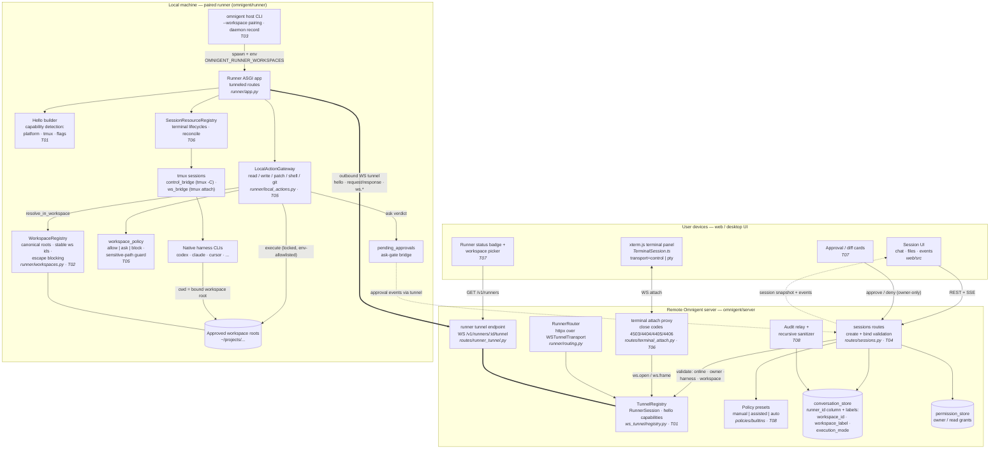
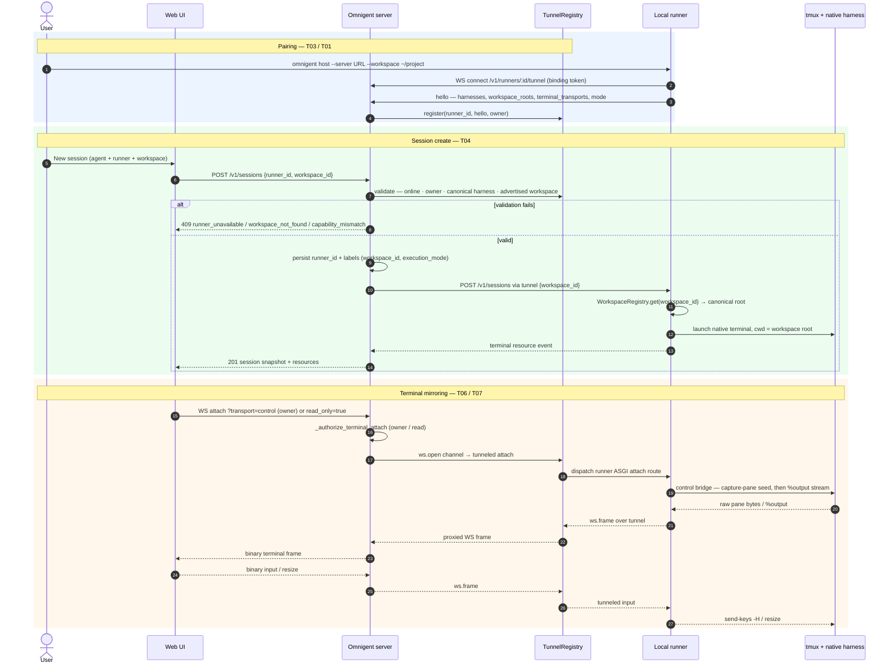
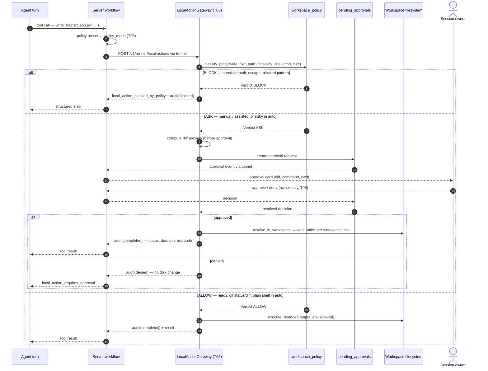
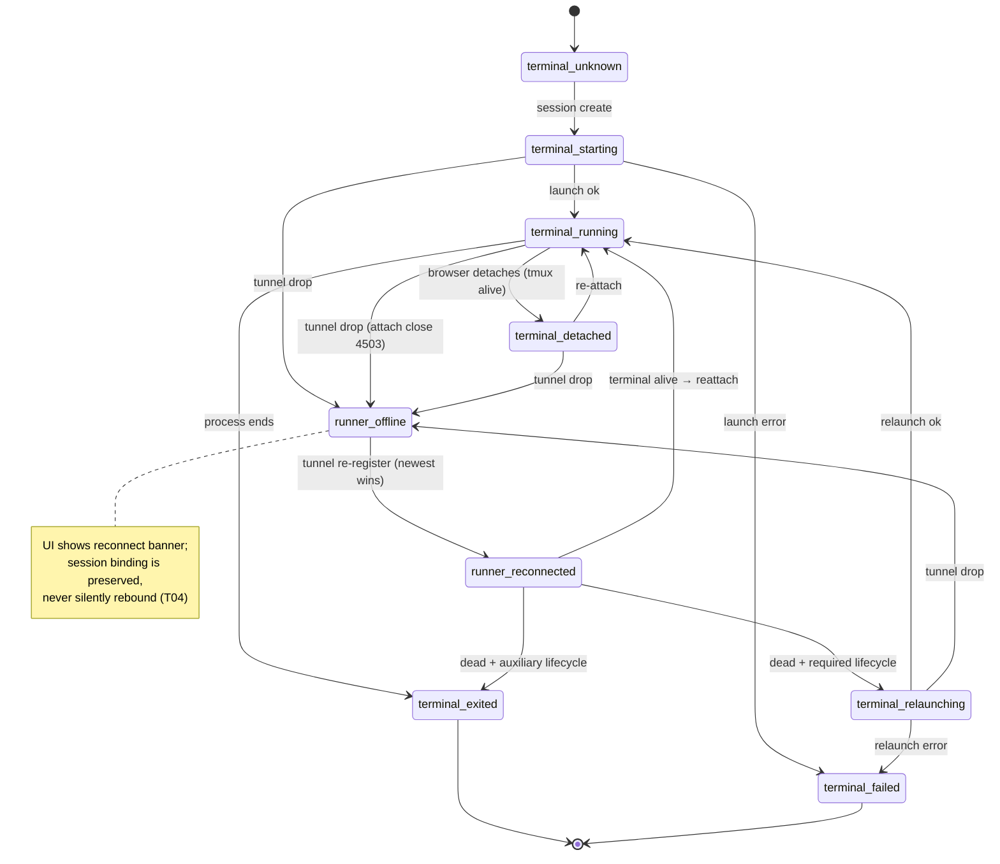
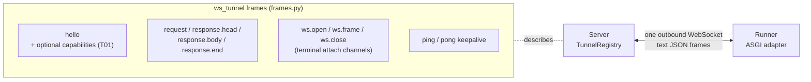

# 06 — Architecture Diagrams

Mermaid diagrams for the remote/local runner MVP. Component names map 1:1 to the task
specs in `tasks/` (T01–T08) and to real repository modules. Planning artifact only.

## 1. Full system architecture

Key boundary (T02/T05): the server coordinates, authorizes, and persists; **only the
runner resolves and enforces paths**. `workspace_label` on the server is display-only.

## 2. Pairing, session create, and terminal mirroring

## 3. Local action with approval gate

## 4. Terminal / runner lifecycle states (T06)

## 5. Tunnel frame protocol (context)

