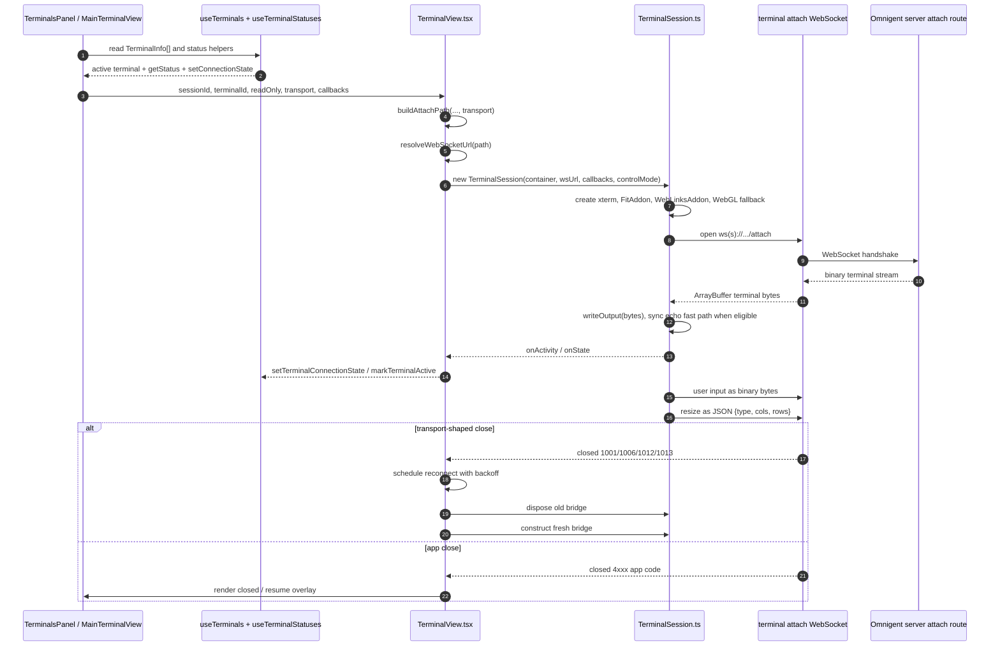
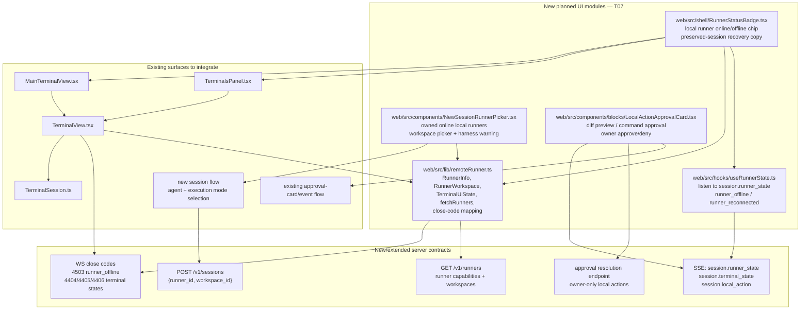
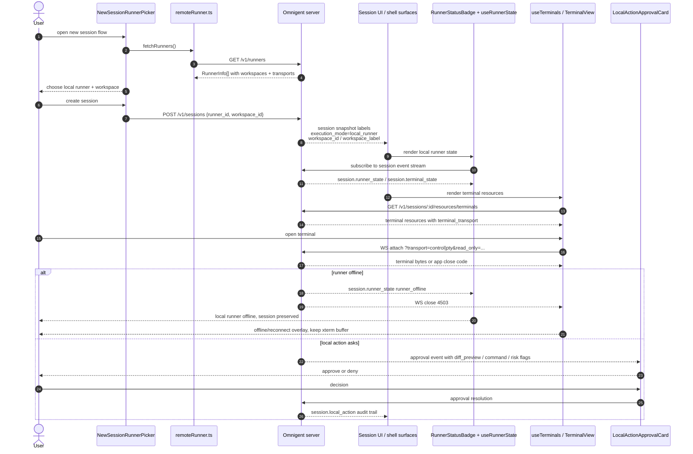
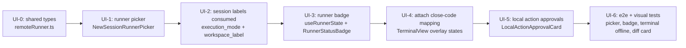

# 07 — UI Codebase Mermaid Diagrams

Planning artifact only. This file maps the remote/local runner MVP onto the current web UI codebase and the planned T07 additions. It intentionally documents code ownership and integration seams; it does not change runtime code.

## 1. Current terminal UI code ownership

The existing terminal UI already has a clean split between shell surfaces, terminal-resource data, terminal status derivation, and the low-level xterm/WebSocket bridge.

```mermaid
flowchart TB
    subgraph surfaces["Terminal surfaces"]
        PANEL["web/src/shell/TerminalsPanel.tsx<br/>right-side Shells panel<br/>list + selected xterm"]
        MAIN["web/src/shell/MainTerminalView.tsx<br/>terminal-first main column<br/>agent terminal or rail-opened shell"]
    end

    subgraph terminal_data["Terminal data + status hooks"]
        UTERMS["web/src/hooks/useTerminals.ts<br/>HTTP seed + SSE-driven query cache<br/>TerminalInfo mapping"]
        USPLIT["web/src/shell/useTerminalSplit.ts<br/>inventory filter + active terminal selection"]
        USTAT["web/src/shell/useTerminalStatuses.ts<br/>connection state + recent activity"]
        TSTATUS["web/src/shell/terminalStatus.tsx<br/>deriveTerminalStatus + TerminalStatusBadge"]
        ACTIVITY["web/src/store/terminalActivity<br/>session.terminal.activity pulses"]
        RUNNERHEALTH["web/src/hooks/RunnerHealthProvider<br/>runner-online edge correction"]
    end

    subgraph bridge["xterm attach bridge"]
        TVIEW["web/src/components/blocks/TerminalView.tsx<br/>React shell, reconnect overlay,<br/>buildAttachPath/buildAttachUrl"]
        TSESSION["web/src/components/blocks/TerminalSession.ts<br/>plain TS bridge: xterm + WebSocket<br/>binary PTY bytes, resize JSON, input hot path"]
        XTERM["@xterm/xterm + addons<br/>FitAddon · WebLinksAddon · WebglAddon"]
    end

    subgraph server_api["Existing server API contracts"]
        TERMSAPI["GET /v1/sessions/:id/resources/terminals<br/>authoritative terminal resources"]
        CREATEAPI["POST /v1/sessions/:id/resources/terminals<br/>launch declared terminal"]
        ATTACHAPI["WS /v1/sessions/:id/resources/terminals/:terminal_id/attach<br/>?transport=control|pty&read_only=true"]
        SSE["Session SSE events<br/>session.resource.created/deleted<br/>session.terminal.activity"]
    end

    PANEL --> USPLIT
    USPLIT --> UTERMS
    USPLIT --> USTAT
    USPLIT --> TSTATUS
    USTAT --> ACTIVITY
    USTAT --> TSTATUS
    PANEL --> TVIEW

    MAIN --> UTERMS
    MAIN --> USTAT
    MAIN --> TSTATUS
    MAIN --> TVIEW

    TVIEW --> TSESSION
    TSESSION --> XTERM

    UTERMS --> TERMSAPI
    UTERMS --> CREATEAPI
    UTERMS -. "cache patched by" .- SSE
    UTERMS --> RUNNERHEALTH
    TSESSION <-->|"binary frames + resize JSON"| ATTACHAPI
```

## 2. Existing attach lifecycle inside the UI

`TerminalView` owns React state and reconnect policy. `TerminalSession` owns xterm, WebSocket listeners, binary input/output, resize, copy behavior, and cleanup.

## 3. Planned remote/local runner UI additions

T07 should extend the current UI rather than replacing it. New files are mostly thin state, picker, badge, and approval-card layers around existing terminal primitives.

## 4. Remote/local runner UI data flow

This is the target user-facing flow after T01–T08 are implemented.

## 5. Implementation order for UI PRs

Suggested PR boundaries:

1. `remoteRunner.ts` types and tests, no visible UI.
2. New-session runner/workspace picker behind `remote_local_runner` feature flag.
3. Runner badge and offline/reconnect event handling.
4. Terminal close-code mapping and transport fallback behavior.
5. Local action approval card and audit-event rendering.

## Notes for implementers

- Keep the existing `TerminalView` / `TerminalSession` split. `TerminalSession` should stay a plain TypeScript bridge outside React render cycles.
- Do not open WebSocket attaches for every terminal just to compute status. The current `useTerminalSplit` / `useTerminalStatuses` design intentionally avoids fan-out attaches.
- Prefer control transport when advertised by the runner, but keep PTY fallback and debug override.
- Runner offline must read as recoverable: the session binding is preserved and should not be silently rebound.
- Approval cards must show local diffs/commands before the owner decides; audit events must stay payload-free.
