# 07 — UI/UX Surface to Codebase File Mapping

Maps the MVP user experience (terminal view, chat, diffs, approval prompts, session
history, local/remote split execution) to the concrete files and modules identified in
the task specs (`tasks/T01`–`T08`). Planning artifact only.

```mermaid
flowchart TB
    %% ─────────────────────────────────────────
    %% UX surfaces
    %% ─────────────────────────────────────────
    subgraph UX["MVP UI / UX surface — web/src"]
        NEW["New session flow<br/>choose agent · runner · workspace"]
        HEADER["Session header<br/>runner badge · workspace label · reconnect state"]
        CHAT["Chat / event feed<br/>agent messages · local-action audit lines"]
        TERM["Terminal panel<br/>xterm.js · control/pty attach · preserved buffer"]
        APPROVAL["Approval card<br/>diff preview · command/cwd · approve/deny"]
        SETTINGS["Runner setup empty state<br/>copy CLI pairing command"]
    end

    %% ─────────────────────────────────────────
    %% Frontend code files
    %% ─────────────────────────────────────────
    subgraph WEB["Frontend implementation files"]
        RR["web/src/lib/remoteRunner.ts<br/>RunnerInfo · TerminalUiState · attachQuery"]
        HOOK["web/src/hooks/useRunnerState.ts<br/>session.runner_state listener"]
        PICKER["web/src/components/NewSessionRunnerPicker.tsx<br/>runner/workspace picker"]
        BADGE["web/src/shell/RunnerStatusBadge.tsx<br/>online/offline UX"]
        TS["web/src/components/blocks/TerminalSession.ts<br/>existing xterm ↔ WS bridge"]
        MAINTERM["web/src/shell/MainTerminalView.tsx<br/>terminal overlay · reconnect"]
        TERMPANEL["web/src/shell/TerminalsPanel.tsx<br/>terminal panel container"]
        CARD["web/src/components/blocks/LocalActionApprovalCard.tsx<br/>diff/command approval UI"]
        DIFF["existing DiffView / code diff viewer<br/>reuse for diff_preview"]
    end

    %% ─────────────────────────────────────────
    %% Server contracts
    %% ─────────────────────────────────────────
    subgraph SERVER["Server contracts — omnigent/server + stores"]
        RUNNERS["GET /v1/runners<br/>capability summary"]
        SESS["POST /v1/sessions<br/>runner_id · workspace_id binding"]
        ATTACH["WS terminal attach<br/>/v1/sessions/.../terminals/.../attach<br/>close codes 4503/4404/4405/4406"]
        EVENTS["session event stream<br/>runner_state · terminal_state · local_action"]
        APPROVE["approval decision endpoint<br/>owner-only approve/deny"]
        CSTORE["conversation_store<br/>runner_id + labels:<br/>workspace_id · workspace_label · execution_mode"]
        PSTORE["permission_store<br/>owner/read grants"]
    end

    %% ─────────────────────────────────────────
    %% Runner contracts
    %% ─────────────────────────────────────────
    subgraph RUNNER["Local runner — omnigent/runner"]
        TUNNEL["ws_tunnel<br/>hello · request/response · ws.frame"]
        HELLO["hello capabilities<br/>harnesses · workspaces · terminal_transports"]
        WREG["WorkspaceRegistry<br/>stable workspace IDs · canonical roots"]
        GATE["LocalActionGateway<br/>read/write/patch/shell/git"]
        WPOL["workspace_policy<br/>allow · ask · block<br/>sensitive-path guard"]
        PEND["pending_approvals<br/>approval bridge"]
        SRES["SessionResourceRegistry<br/>terminal lifecycle · reconcile"]
        TMUX["tmux control/pty bridge<br/>control_bridge.py · ws_bridge.py"]
        FS["approved local workspace roots"]
    end

    %% ─────────────────────────────────────────
    %% UX to frontend file mapping
    %% ─────────────────────────────────────────
    NEW --> PICKER
    NEW --> SETTINGS
    HEADER --> BADGE
    HEADER --> HOOK
    CHAT --> RR
    CHAT --> CARD
    TERM --> TS
    TERM --> MAINTERM
    TERM --> TERMPANEL
    APPROVAL --> CARD
    CARD --> DIFF

    PICKER --> RR
    BADGE --> RR
    HOOK --> RR
    MAINTERM --> RR
    TS --> RR

    %% ─────────────────────────────────────────
    %% Frontend to server contracts
    %% ─────────────────────────────────────────
    RR -->|"fetchRunners()"| RUNNERS
    PICKER -->|"create session payload"| SESS
    TS <-->|"attach WS<br/>transport=control/pty"| ATTACH
    HOOK <-->|"SSE/WS events"| EVENTS
    CARD -->|"approve / deny"| APPROVE

    %% ─────────────────────────────────────────
    %% Server internals
    %% ─────────────────────────────────────────
    SESS --> CSTORE
    SESS --> PSTORE
    SESS -->|"validate owner · online · harness · workspace"| RUNNERS
    ATTACH -->|"authorize owner/read"| PSTORE
    EVENTS --> CSTORE
    APPROVE --> PSTORE

    %% ─────────────────────────────────────────
    %% Server to runner
    %% ─────────────────────────────────────────
    RUNNERS <-->|"registered hello"| TUNNEL
    SESS -->|"POST /v1/sessions via tunnel"| TUNNEL
    ATTACH <-->|"ws.open / ws.frame"| TUNNEL
    APPROVE -->|"decision via tunnel"| PEND
    EVENTS <-->|"audit + lifecycle events"| TUNNEL

    %% ─────────────────────────────────────────
    %% Runner internals
    %% ─────────────────────────────────────────
    TUNNEL --> HELLO
    HELLO --> WREG
    TUNNEL --> GATE
    GATE --> WPOL
    GATE --> WREG
    GATE --> PEND
    GATE --> FS
    TUNNEL --> SRES
    SRES --> TMUX
    TMUX --> FS

    %% ─────────────────────────────────────────
    %% UX state annotations
    %% ─────────────────────────────────────────
    BADGE -. "offline copy: session preserved" .-> HEADER
    MAINTERM -. "keep xterm mounted during runner_offline" .-> TERM
    CARD -. "diff preview before approval" .-> APPROVAL
    WREG -. "server label is display-only; runner enforces path" .-> CSTORE
```

Reading guide: the UX subgraph is what the user sees (plan `03-terminal-mirroring-ui-plan.md`
Tasks UI-1…UI-5); the frontend files come from `tasks/T07`; server contracts from
`tasks/T01/T04/T06/T08`; runner modules from `tasks/T02/T03/T05/T06`. Dotted edges are
UX invariants, not data flow.
