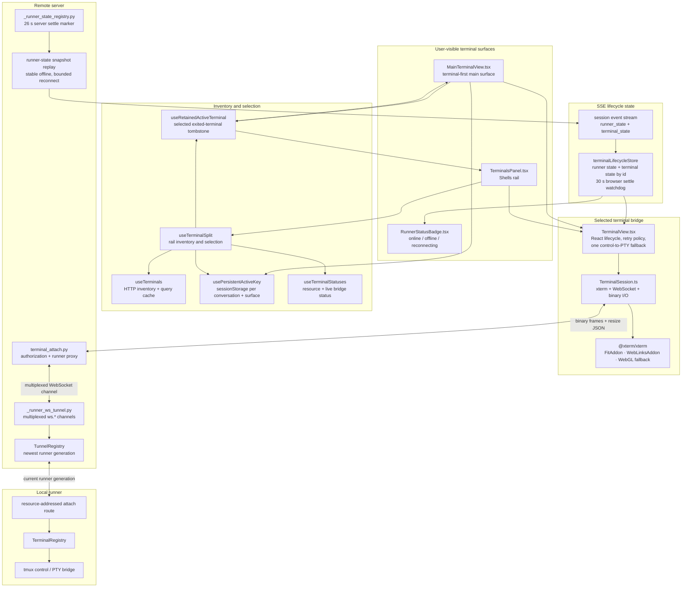
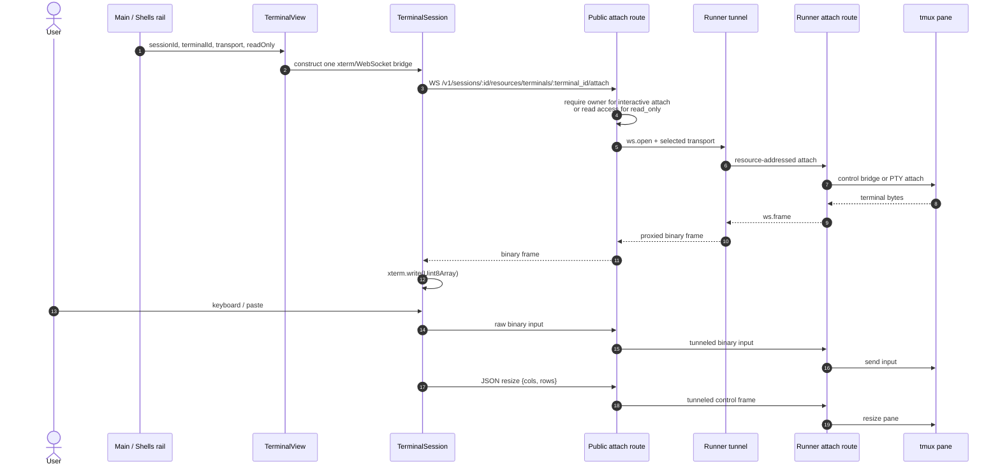
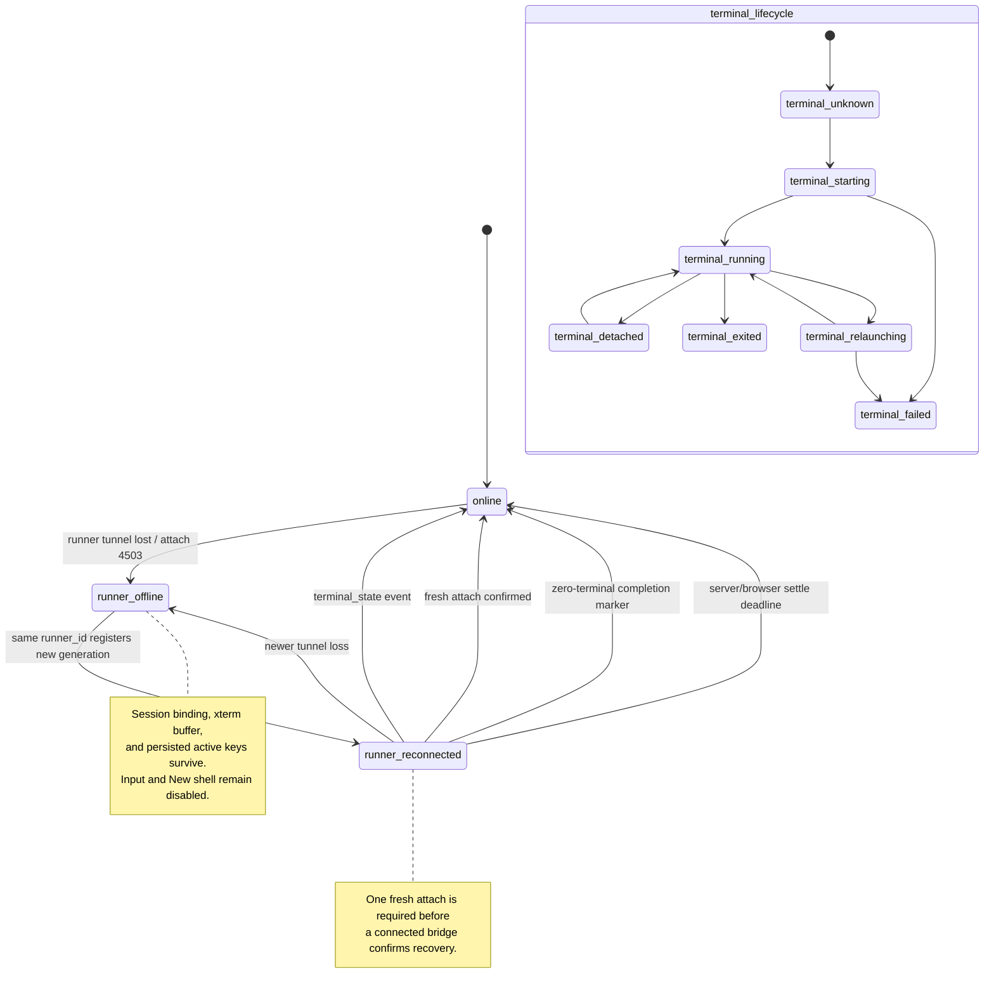
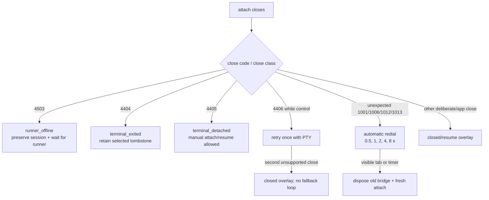
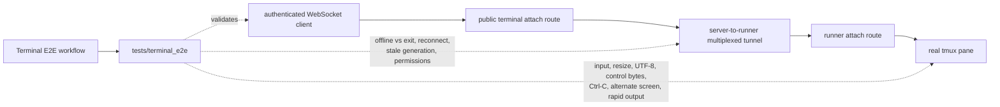

# 08 — Reconnect-Safe Terminal Runtime Diagrams

Status reviewed on 2026-07-17 against PR #3,
`feat/mvp-terminal-mirroring`, stacked on PR #2. These diagrams describe the
implemented browser, server, runner-tunnel, and tmux paths. They replace the
older planned T07 module map.

## 1. Runtime ownership



Only the selected terminal opens a live attach WebSocket. Unselected terminal
rows derive status from resource/lifecycle state instead of creating fan-out
tmux attaches.

## 2. Public attach and byte path



Control transport seeds the xterm buffer from tmux capture and then streams
output. PTY remains a fallback path; product-level PTY parity is still an open
decision.

## 3. Runner loss and bounded reconciliation

```mermaid
sequenceDiagram
    autonumber
    participant Tmux
    participant Runner
    participant Registry as TunnelRegistry
    participant State as Server runner-state registry
    participant SSE as Session stream
    participant Store as Browser lifecycle store
    participant View as TerminalView

    Note over Tmux,View: Stable connected terminal
    Tmux-->>View: terminal I/O through runner tunnel

    Runner-xRegistry: tunnel generation disconnects
    Registry->>State: record runner_offline
    State->>SSE: session.runner_state runner_offline
    Registry-->>View: attach closes as 4503
    SSE-->>Store: runner_offline
    Store->>View: disable input; preserve terminal/session selection

    Runner->>Registry: reconnect same runner_id with new generation
    Registry->>State: record runner_reconnected
    State->>State: schedule 26 s bounded completion
    State->>SSE: session.runner_state runner_reconnected
    SSE-->>Store: clear stale per-terminal lifecycle map<br/>start 30 s browser watchdog
    Store->>View: force one fresh-generation reattach

    Registry->>Runner: reconcile terminal resources (bounded server path)
    alt live terminals re-emitted
        Runner-->>SSE: session.terminal_state terminal_running
        SSE-->>Store: terminal state ends reconciliation
        View->>Registry: fresh attach opens
        View->>Store: confirmRunnerAttached
    else zero terminals
        Registry->>State: complete_reconciliation(terminal_count=0)
        State->>SSE: compatibility terminal_unknown marker
        SSE-->>Store: end reconciliation
    else reconcile event is lost / fails / times out
        State->>SSE: 26 s terminal_unknown completion marker
        SSE-->>Store: end reconciliation
        opt server marker also missed
            Store->>Store: 30 s settleReconciliation
        end
    end

    Note over State,Store: Every completion path rechecks current state.<br/>A newer runner_offline edge is not overwritten.
```

`runner_offline` is stable and replayable. `runner_reconnected` is a transient
edge: server replay expires after 30 seconds and both server and browser have
bounded ways to leave reconciliation.

## 4. Browser and server lifecycle state model



Runner state and individual terminal state are separate. A runner outage does
not rewrite every terminal as exited, and a terminal exit does not imply the
runner is offline.

## 5. Attach close-code and retry behavior



The retry budget resets only after a connection remains stable for 30 seconds,
which prevents both permanent exhaustion across unrelated outages and an
infinite connect/drop loop.

## 6. Independent selection and exited-terminal retention

```mermaid
sequenceDiagram
    autonumber
    actor User
    participant Main as MainTerminalView
    participant Rail as TerminalsPanel
    participant Storage as sessionStorage
    participant Inventory as useTerminals
    participant Retain as useRetainedActiveTerminal
    participant Lifecycle as terminalLifecycleStore

    User->>Main: select terminal A
    Main->>Storage: set omnigent.activeTerminalKey.&lt;conversation&gt;.main = A

    User->>Rail: select terminal B
    Rail->>Storage: set omnigent.activeTerminalKey.&lt;conversation&gt;.rail = B
    Note over Main,Rail: Main and rail selections do not overwrite each other

    Inventory-->>Rail: transient empty inventory while runner offline
    Rail->>Storage: keep B because runner state is not authoritative online

    Lifecycle-->>Retain: terminal B = terminal_exited
    Inventory-->>Retain: B removed from runnable inventory
    Retain-->>Rail: last selected B retained as exited tombstone
    Note over Rail: Other live terminal rows remain selectable and usable

    Inventory-->>Rail: authoritative online inventory excludes stale key
    alt no exited tombstone
        Rail->>Storage: prune stale selection
    else exited tombstone
        Rail->>Storage: retain key long enough to show terminal-exited state
    end
```

Persistence is best-effort and scoped to the browser session, conversation, and
surface. It is not server-side terminal ownership.

## 7. Executable acceptance boundary



Still outside the live boundary:

- a literal browser page reload with SSE bootstrap while offline, followed by
  automatic recovery;
- PTY byte-parity CI, only if PTY remains a supported product contract;
- final human evidence for current-head automatic reconnect and the distinct
  exited-terminal presentation.
