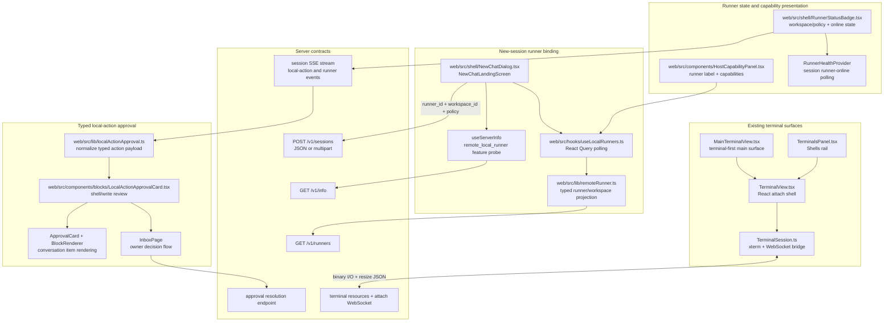
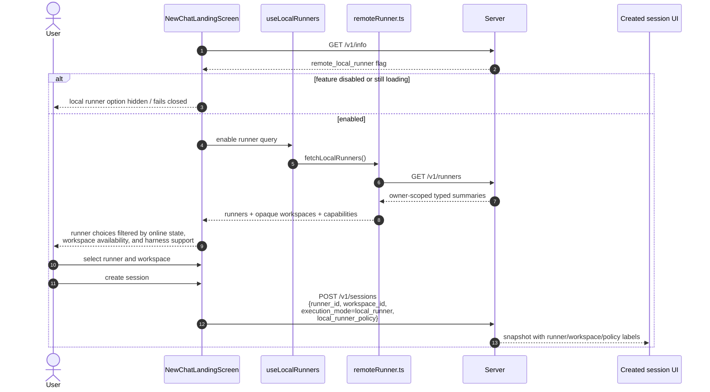
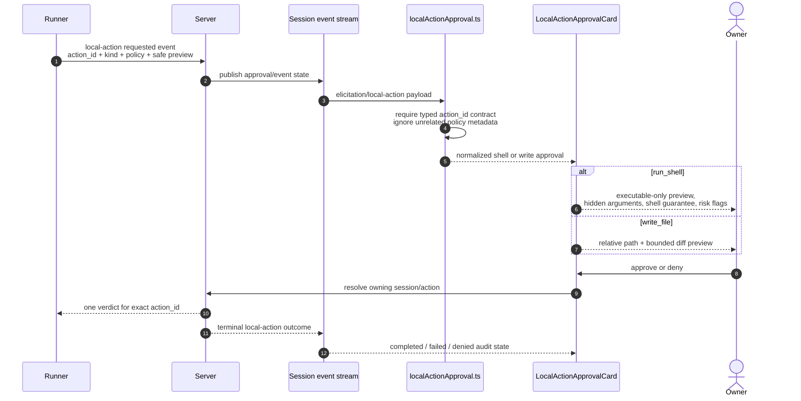
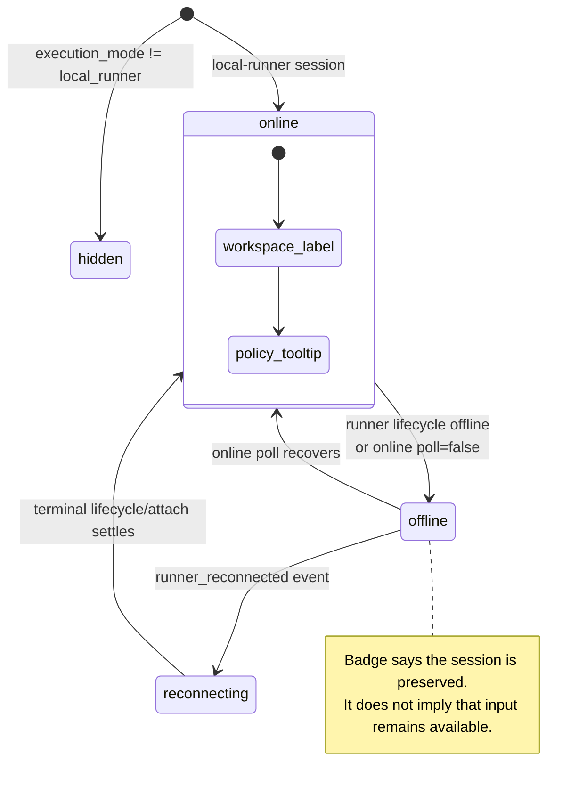

# 08 — Implemented UI and Terminal Runtime Diagrams

Status reviewed on 2026-07-17 against PR #2,
`feat/mvp-runner-binding-approvals`. This file maps the UI modules and server
contracts that are actually wired on the branch. PR #3 adds the reconnect-safe
terminal lifecycle, persisted terminal selection, and live terminal acceptance
details.

## 1. UI ownership on PR #2



There is no separate `NewSessionRunnerPicker.tsx` or planned
`useRunnerState.ts` layer on this branch. The picker is integrated into
`NewChatLandingScreen`, while runner lifecycle state is consumed through the
existing terminal lifecycle store and runner-health provider.

## 2. Canonical new-session UI flow



Selecting the local-runner path clears any host/raw-workspace selection, and
selecting a host or managed sandbox clears the local-runner selection. The
contracts remain mutually exclusive.

## 3. Typed approval rendering and decision flow



The card never needs the canonical local workspace root. Relative paths and
display-only labels are sufficient for review.

## 4. Runner status presentation



PR #2 supplies the runner status and approval surfaces. PR #3 makes the
terminal-side offline/reconnect behavior generation-safe and bounded.

## 5. Terminal bridge boundary inherited by PR #2

```mermaid
sequenceDiagram
    autonumber
    participant Surface as MainTerminalView / TerminalsPanel
    participant View as TerminalView
    participant Bridge as TerminalSession
    participant Server as terminal attach route
    participant Runner as runner attach route
    participant Tmux as tmux pane

    Surface->>View: sessionId + terminalId + transport + readOnly
    View->>Bridge: construct xterm/WebSocket bridge
    Bridge->>Server: WS attach with transport/read_only
    Server->>Server: authorize owner write or collaborator read
    Server->>Runner: multiplex ws.open over runner tunnel
    Runner->>Tmux: control or PTY attach
    Tmux-->>Bridge: binary terminal bytes through runner/server
    Bridge->>Tmux: binary input; resize JSON through runner/server
```

The detailed reconnect state machine, close-code handling, bounded settlement,
per-surface selection persistence, exited-terminal retention, and real tmux
acceptance boundary live in the PR #3 version of this document.
