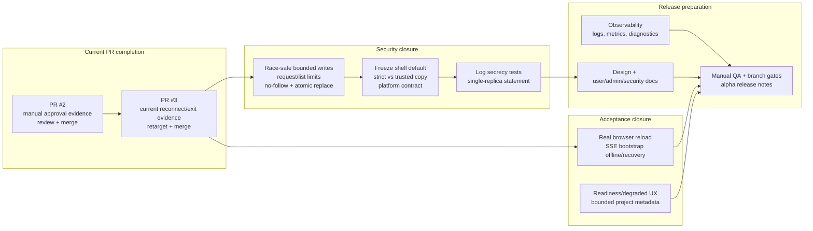

# Remaining work — dependency tracks

Status reviewed on 2026-07-17 against active PR #2 and PR #3. The old assumption that
T10-01 through T10-04 are wholly open is no longer true: canonical discovery/binding,
the picker, strict/trusted shell mechanisms, secret-safe audit persistence, truthful
gateway advertisement, and real tmux terminal acceptance are substantially implemented.

The remaining work is now a hardening, acceptance, and release-preparation program.

## Current branch model

- `feat/mvp-runner-binding-approvals` is PR #2 and owns canonical runner binding,
  local-action policy/audit, and approval UI.
- `feat/mvp-terminal-mirroring` is PR #3, stacked on PR #2, and owns terminal parity,
  lifecycle, reconnect, and terminal selection state.
- `feat/mvp-remaining-tracks` exists at `900b936a` but has diverged substantially from
  the active stack. It is a legacy comparison branch, not a status source or merge
  target. Review unique commits, cherry-pick intentional survivors, then retire it.

## Dependency graph

## Track 1 — finish and merge the active stack

### PR #2: runner binding and approvals

Already delivered:

- owner-scoped `/v1/runners` with opaque workspace summaries;
- `runner_id + workspace_id` JSON and multipart creation;
- mixed host/raw-path contract rejection;
- owner/workspace/harness validation and persisted runner affinity;
- runner/workspace picker using opaque IDs;
- local actions, policy modes, owner approval, typed cards, exact-`action_id`
  persistence, and secret-safe history;
- strict Bubblewrap execution mode plus truthful trusted-machine labeling.

Still required before ready-for-review:

1. capture a typed shell approval accepted exactly once;
2. capture a typed write approval rejected with the file absent;
3. update the PR description to current commit/check status;
4. request review and merge before PR #3 is retargeted.

### PR #3: terminal mirroring

Already delivered:

- authenticated public terminal attachment through the runner tunnel;
- real tmux byte/input/lifecycle acceptance and active CI gates;
- fresh-generation reconnect, stale-frame rejection, bounded server/client settlement;
- runner-offline, terminal-exited, detached, and unsupported-transport distinctions;
- independent main/rail persisted selection and exited-terminal retention.

Still required before ready-for-review:

1. capture automatic reconnect on the current product-code baseline;
2. capture the distinct terminal-exited state while the runner remains online;
3. after PR #2 merges, retarget to `mvp-v0` and verify the terminal-only diff;
4. request review and merge.

## Track 2 — race-safe bounded workspace writes

This is the next technical PR after the active stack:

`fix(local-actions): harden race-safe bounded workspace writes`

Required scope:

1. bound write content/request size before diff generation and approval;
2. bound `list_dir` entries and serialized result size;
3. after approval, securely re-resolve from the workspace root;
4. use directory-FD/no-follow traversal where supported;
5. write a sibling temporary file with safe creation flags, fsync as appropriate, and
   atomically replace the approved target;
6. preserve stale-content conflict detection;
7. add symlink-swap, parent-replacement, create-vs-replace, oversized-request, and
   approval-wait race regressions;
8. document platform behavior where equivalent no-follow primitives differ.

## Track 3 — shell and audit contract freeze

The mechanisms exist; the product promise is not yet final.

1. Choose the supported/default alpha shell mode:
   - strict workspace mode when Bubblewrap is present; or
   - trusted-machine execution after owner approval.
2. State platform availability and fail-fast/fallback behavior.
3. Align presets, capability copy, approval cards, and documentation with the actual
   `shell_guarantee` value.
4. Add server and runner log-capture tests for tokens, headers, full commands, paths,
   file contents, diffs, and output.
5. State single-replica approval support for alpha or move pending approval ownership to
   shared storage.

Persisted local-action history already uses an allowlist, value redaction, bounded
fields, relative paths, and an argument-free executable-only `command_summary`.

## Track 4 — browser reload acceptance

The real tmux/server/runner/WebSocket fixture is active. The missing live case is a
literal browser page reload with SSE bootstrap:

1. connect to a terminal and select independent main/rail targets;
2. take the runner offline;
3. reload the page while offline;
4. verify preserved-session state and restored selections;
5. reconnect the runner and verify automatic bounded settlement;
6. verify input returns to the intended terminal without selecting a row manually.

PTY parity remains conditional on a product decision. Do not add a PTY gate merely to
match an old planning document.

## Track 5 — readiness UX and observability

These can proceed after the binding and security contracts are stable:

- bounded git/project summary and shell inventory;
- explicit per-harness readiness and degraded reasons;
- one unified runner readiness projection;
- structured runner connect/disconnect/reconnect logs;
- terminal attach transport and close-code metrics;
- workspace-validation and capability-mismatch metrics;
- diagnostics/admin projection for current runner readiness.

## Track 6 — design, documentation, and rollout

1. Add `designs/REMOTE_LOCAL_RUNNER.md`.
2. Add `designs/LOCAL_RUNNER_PERMISSIONS.md`.
3. Keep `designs/TERMINAL_MIRRORING_ACCEPTANCE.md` mapped to executable evidence.
4. Add user pairing/workspace-selection, admin enablement/recovery, security, retention,
   and troubleshooting documentation.
5. Add a manual QA script for two users, approval denial, reconnect, browser reload,
   and secret checks.
6. Map dev/alpha/beta requirements to named branch-protection jobs.
7. Publish release notes only after the alpha gate is green.

## Solo execution order

1. Finish manual evidence and merge PR #2.
2. Retarget, revalidate, and merge PR #3.
3. Implement race-safe bounded writes.
4. Freeze shell and audit support statements and add log-secrecy tests.
5. Add the real browser reload acceptance case.
6. Complete readiness UX and observability.
7. Finalize design records, product docs, manual QA, and rollout gates.
8. Reconcile and retire `feat/mvp-remaining-tracks` without merging it wholesale.
