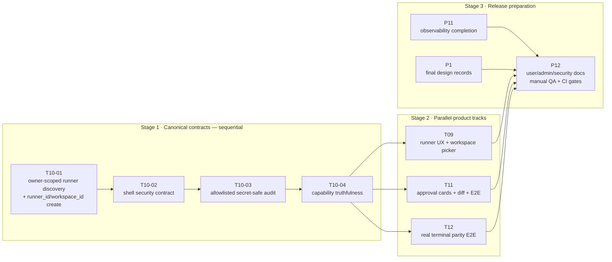

# Remaining work — dependency tracks

Status reviewed after `0f3e5ce3`. T01–T08 contain substantial implementation, but
the remaining work cannot start from the old hosts/raw-path assumptions. T10 is the
sequential critical path. After T10, three product tracks can run in parallel.

## Dependency graph

## Stage 1 — strict order

### T10-01: canonical discovery and session binding

Freeze one owner-scoped public read model for live local runners and workspaces. The
recommended shape is a dedicated `/v1/runners` projection; extending `/v1/hosts` is
acceptable only if it returns an explicit `runner_id` and opaque workspaces without
exposing local absolute roots.

Then wire public session creation to `runner_id + workspace_id`. Keep the existing
`host_id + workspace` launch flow separate. No picker work should land before this
contract and its route tests are stable.

### T10-02: shell security

Choose and implement one truthful guarantee:

- strict workspace mode backed by an OS sandbox; or
- trusted-machine shell access after owner approval, with all containment claims
  removed.

Approval is not a sandbox. The decision changes policy copy, acceptance tests, audit
requirements, and user/admin documentation, so it must precede those tasks.

### T10-03: audit schema freeze

Persist only an allowlisted bounded terminal-outcome schema. Remove raw command
summaries and absolute paths, add value-level redaction/log-capture tests, request
limits, and race-safe revalidation.

### T10-04: capability truthfulness

Every advertised action must have one documented authorization, workspace, audit, and
bounded-output path. Converge search/git reads on the gateway or remove them from that
capability advertisement. Keep `apply_patch` unadvertised until implemented.

## Stage 2 — parallel tracks

### T09: runner UX

Depends on T10-01 for types and create payload and on T10-04 for truthful capability
copy. Internal order:

1. fetch and type the canonical runner discovery response;
2. workspace/policy picker using opaque IDs;
3. capability and degraded-readiness dashboard.

### T11: approval UI

Depends on T10-02 and T10-03. Internal order:

1. normalize live local-action approval state;
2. shell/write cards with safe command category and live diff preview;
3. owner approve/deny E2E, including denial leaves files unchanged.

`apply_patch` UI remains conditional on a real backend action.

### T12: terminal parity E2E

May begin its fixture after T10-01 and run independently from T09/T11. Internal order:

1. real server + runner + tmux + browser fixture;
2. byte/input parity tests;
3. active-output reconnect, browser refresh, and terminal/runner failure-state tests.

## Work that may overlap

- Draft P1 design records while implementing T10, but finalize them only after the
  contracts land.
- Add P11 instrumentation alongside the production changes that create each signal.
- Build the T12 fixture while T10-02/03 are being completed, provided it uses the
  canonical T10-01 session API.

## Solo execution order

1. T10-01 canonical discovery and session binding.
2. T10-02 shell decision and enforcement/documentation.
3. T10-03 audit schema and secret tests.
4. T10-04 capability convergence.
5. Start T12 fixture.
6. Implement T09 picker and T11 approval cards in either order.
7. Finish T12 parity/reconnect cases.
8. Complete P11, finalize P1, then P12 docs/manual QA/CI gates.

## Release rule

P12 is last because it describes the actual supported contract. Do not publish a
workspace-containment claim, multi-replica approval claim, or beta readiness statement
until the corresponding acceptance tests and CI jobs exist.
