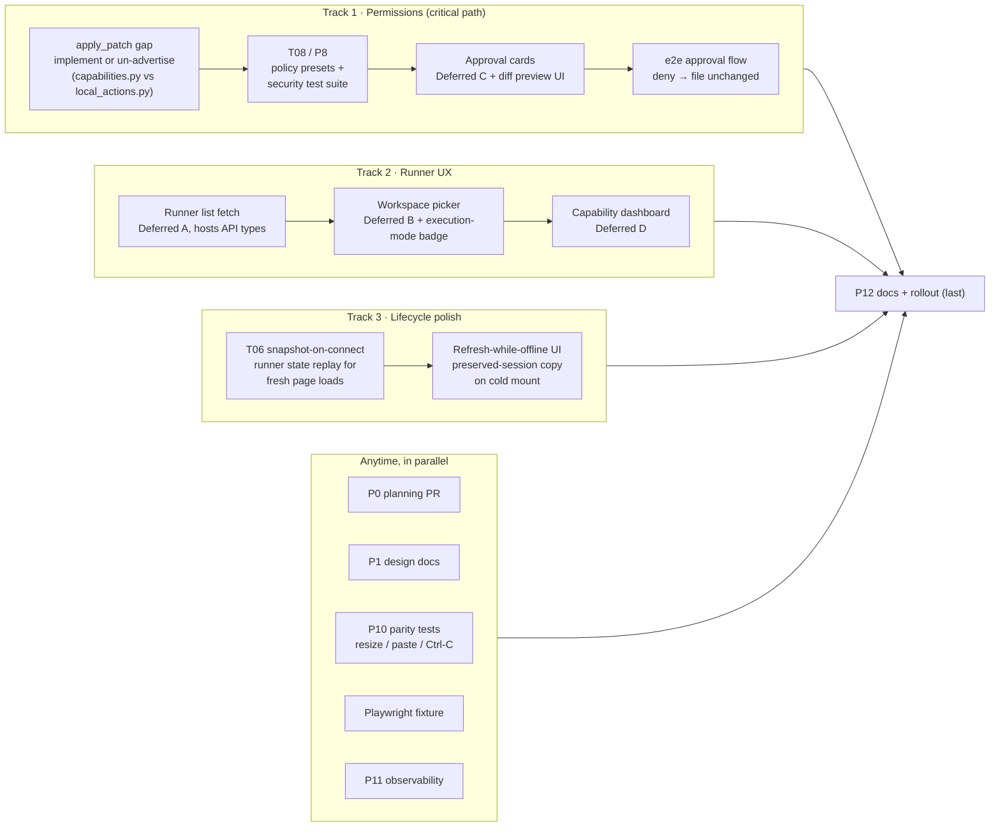

# Remaining work — dependency tracks

Status as of `7b045066` (T01–T07 landed on `mvp-v0`). Three independent
tracks run in parallel; steps inside a track are sequential. The
"anytime" pool has no dependencies except P12, which lands last.

## Track diagram

## Sequencing rationale

- **Track 1 is strictly sequential.** Approval/diff cards consume T08's
  approval event model, and T08 should not start until the `apply_patch`
  decision is made: the hello frame advertises `apply_patch` in
  `DEFAULT_TOOL_CAPABILITIES` but no runner-side implementation exists,
  so presets would be built on a moving gateway surface.
- **Track 2 is unblocked today.** The hosts API already lists runners
  (`omnigent/server/routes/hosts.py`), so Deferred A needs only web
  types + fetch before the picker can start.
- **Track 3 is server-side and independent** of both UI tracks; the
  refresh-while-offline copy depends on the snapshot frame existing.
- **Playwright fixture early pays off**: e2e items in all three tracks
  queue behind it.
- **P12 last**: user/admin/security/troubleshooting docs describe the
  end state, so they wait for the tracks to converge.

## Solo order (recommended)

1. `apply_patch` decision (Track 1, step 1)
2. T06 snapshot-on-connect (Track 3 — small, improves refresh UX early)
3. T08 policies + security tests
4. Deferred A/B in parallel with T08's test-writing tail
5. Approval cards, then dashboard
6. P12 docs + rollout
